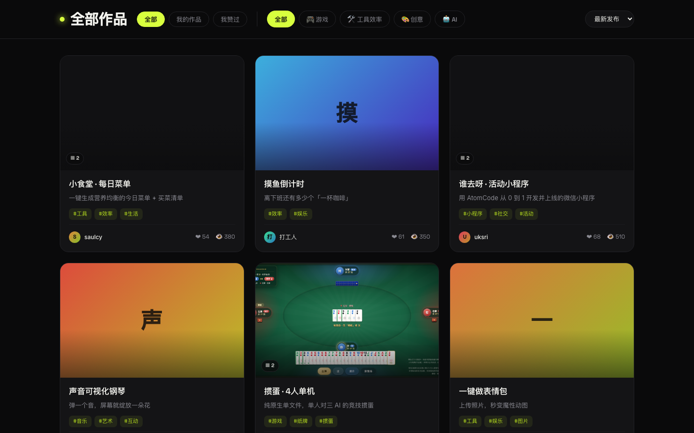
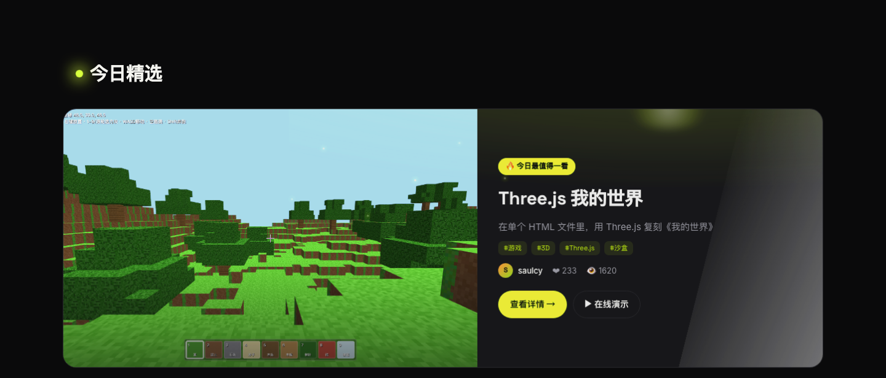

# AtomCode 灵感展示墙

> 展示、浏览、互动并二次创作用 **AtomCode** 打造的应用与有趣程序。
> 一面属于创造者的「案例墙」—— 从这里出发，也许下一个改变世界的灵感就轮到你。

<p align="center">
  
</p>

<p align="center">
  <a href="https://welsie.github.io/atomcode-showcase/"><b>🌐 在线访问</b></a>
  &nbsp;·&nbsp;
  
  
  
  
</p>

---

## 📖 目录

- [这是什么](#-这是什么)
- [核心特性](#-核心特性)
- [界面预览](#-界面预览)
- [精选案例](#-精选案例)
- [第一屏：改变世界的科技里程碑](#-第一屏改变世界的科技里程碑)
- [技术栈](#-技术栈)
- [项目结构](#-项目结构)
- [本地运行](#-本地运行)
- [深链参数](#-深链参数可选)
- [单文件离线版](#-单文件离线版-standalone)
- [数据与隐私](#-数据与隐私)

---

## 🎯 这是什么

AtomCode 灵感展示墙是一个**纯前端**的作品展示社区页面：任何人都可以把自己用 AtomCode
做出来的应用、小游戏、工具发布到这里，供别人浏览、点赞、评论，并**一键二次创作（Remix）**
衍生出新的作品。

它不需要任何后端或数据库 —— 所有数据都保存在浏览器本地（`localStorage`），
打开 `index.html` 即可运行，也可以一键打包成**单个离线 HTML 文件**随处分享。

---

## ✨ 核心特性

### 🌌 电影感第一屏 · 科技里程碑时间轴

进入页面，一个卡通小人会走过一座绳索吊桥，穿过从「1440 古腾堡印刷术」到今天的一个个
改变世界的科技节点，走到 2026 之后**登上飞船升空**，驶入代表「未来 ∞」的节点 ——
寓意：**下一个改变世界的灵感，轮到你**。

- SVG 悬链线吊桥 + `requestAnimationFrame` 驱动的行走 / 登船 / 发射动画
- Canvas 星空流星背景
- 支持左右切换里程碑，尊重 `prefers-reduced-motion`（可访问性）

### 🎨 作品墙 · 浏览与筛选

<p align="center">
  
</p>

- 响应式网格卡片，封面悬停轮播多张截图
- **搜索**：按作品名 / 作者 / 标签实时过滤
- **分类**：游戏 · 工具效率 · 创意 · AI
- **范围**：全部 · 我的作品 · 我赞过
- **排序**：最新发布 · 最受欢迎 · 最多浏览 · 最多衍生

### 🔦 今日精选 & 本周热门

<p align="center">
  
</p>

- **今日精选**：按热度算法挑出单个焦点作品，配剧场级「聚光灯」入场动效（滚动到视口时点亮）
- **本周热门**：7 天内热度 Top 8 横向滑动展示，支持拖拽与左右翻页

### 📄 作品详情 · 画廊式展示

<p align="center">
  
</p>

- 多图截图画廊 + 缩略图切换
- 在线演示 / 体验作品 / 源码链接直达
- 点赞、评论、复制分享链接
- **二次创作传承链**：清晰展示「原作 → … → 当前作品」的衍生血缘

### 🔀 二次创作（Remix）

一键基于任意作品衍生自己的版本，系统自动记录传承关系，让每一个灵感的流动都被看见。

---

## 🖼️ 界面预览

| 第一屏时间轴 | 作品墙 |
| :---: | :---: |
|  |  |
| **今日精选** | **作品详情** |
|  |  |

---

## 📦 精选案例

墙上内置了一批**真实的** AtomCode 作品（真实截图 + 在线演示）：

| 作品 | 一句话简介 | 作者 | 标签 | 源码 |
| --- | --- | --- | --- | --- |
| **3D 圆柱俄罗斯方块** | 把经典俄罗斯方块搬到旋转的圆柱体上，还能召唤魔法小人 | Midora | 游戏 / 3D / 移动端 | [atomgit](https://atomgit.com/Midora/teris-web) |
| **Three.js 我的世界** | 在单个 HTML 文件里，用 Three.js 复刻《我的世界》 | saulcy | 游戏 / 3D / 沙盒 | [atomgit](https://atomgit.com/saulcy/Minecraft) |
| **Incoterms 2020 交互查询** | 零依赖单页应用，快速理解与选择国际贸易术语 | Gary_Yang | 工具 / 外贸 / SPA | [atomgit](https://atomgit.com/Gary_Yang/Incoterms2020) |
| **掼蛋 · 4人单机** | 纯原生单文件，单人对三 AI 的竞技掼蛋 | Midora | 游戏 / 纸牌 / 单机 | [gitcode](https://gitcode.com/Midora/guandan) |
| **谁去呀 · 活动小程序** | 用 AtomCode 从 0 到 1 开发并上线的微信小程序 | uksri | 小程序 / 社交 | [gitcode](https://gitcode.com/uksri/goOrNot) |
| **小食堂 · 每日菜单** | 一键生成营养均衡的今日菜单 + 买菜清单 | saulcy | 工具 / 生活 / 美食 | [gitcode](https://gitcode.com/saulcy/order_a_meal) |

---

## 🕰️ 第一屏：改变世界的科技里程碑

时间轴串起了人类关键的技术跃迁 —— 印刷术、蒸汽机、电、计算机、互联网、智能手机、
AI…… 每一次都始于一个当时不被看好的点子。小人走到「今天」后登船升空，把叙事交给
**未来 ∞** 节点，呼应主标题「下一个改变世界的灵感，轮到你」。

---

## 🛠️ 技术栈

- **纯前端**：原生 HTML + CSS + JavaScript，零框架、零构建依赖
- **Canvas**：星空流星背景、光速流线
- **SVG**：悬链线吊桥、飞船、里程碑节点
- **CSS 动画**：`@keyframes` 驱动的聚光灯、卡片入场、行走小人
- **IntersectionObserver**：滚动揭示动画与「今日精选」聚光灯触发
- **localStorage**：作品 / 点赞 / 评论 / 二创关系的本地持久化
- **无障碍**：全程尊重 `prefers-reduced-motion`

---

## 📁 项目结构

```
atomcode-showcase/
├─ index.html                      # 页面结构
├─ styles.css                      # 全部样式（含移动端适配、动效）
├─ app.js                          # 全部逻辑（数据、渲染、交互、里程碑动画）
├─ assets/
│  ├─ covers/                      # 各案例真实截图封面
│  └─ screenshots/                 # 本 README 用的界面截图
├─ demos/
│  └─ incoterms/                   # 自托管的 Incoterms 在线演示
├─ build-standalone.js             # 单文件打包脚本
└─ atomcode-showcase-standalone.html   # 打包生成的单文件离线版
```

---

## 🚀 本地运行

无需安装任何依赖，直接用浏览器打开即可：

```bash
# 方式一：直接双击 index.html

# 方式二：起一个本地静态服务器（推荐，避免个别浏览器的 file:// 限制）
python3 -m http.server 8080
# 然后访问 http://localhost:8080
```

---

## 🔗 深链参数（可选）

| 参数 | 作用 |
| --- | --- |
| `#work=<id>` | 直接打开指定作品的详情页 |
| `?m=<N>` | 第一屏定位到第 N 个里程碑（静止，便于截图 / 调试） |
| `?start=<N>` | 第一屏从第 N 站开始自动播放 |
| `?flat=1` | 关闭入场 / 揭示动画（截图友好模式） |

---

## 📦 单文件离线版 (standalone)

仓库内的 `atomcode-showcase-standalone.html` 是一个**完全自包含**的单文件版本：
HTML / CSS / JS / 所有图片素材全部内联，**双击即可离线运行**，方便打包、分享、归档。

```bash
# 从多文件源码重新生成单文件版
node build-standalone.js
```

打包脚本做了这些事：

- 把 `styles.css`、`app.js` 内联进 `<style>` / `<script>`
- 把所有封面图片转成 base64 **data URI** 内联
- 把本地 Incoterms 演示指向线上地址（其余演示本就是绝对 URL）
- 为避免内联封面撑爆 `localStorage`（5MB 配额），策展封面在持久化时以占位符存储、
  加载时再从内存重新挂回 —— 你自己发布的作品封面不受影响
- 把本 README 作为注释嵌入文件顶部

> ⚠️ 离线运行时，Web 字体会自动降级为系统字体；案例的「在线演示」链接仍需联网访问。

---

## 📱 移动端适配

页面已完成 WAP 端适配，在手机上同样有良好的浏览体验：顶栏与搜索自适应换行、
里程碑竖向堆叠、筛选工具栏纵向排列、作品墙单列铺满、详情弹窗按钮自动折行。

<p align="center">
  
</p>

---

## 💾 数据与隐私

- 所有数据（你发布的作品、点赞、评论、二创关系）都保存在**你自己浏览器的 `localStorage`** 中
- **没有服务器、没有账号、没有追踪** —— 清除浏览器数据即会重置
- 内置的精选案例来自公开的 AtomGit / GitCode 仓库，均可跳转查看源码与在线演示

---

<p align="center">用 ❤️ 与 <b>AtomCode</b> 打造 —— 下一个改变世界的灵感，轮到你。</p>
